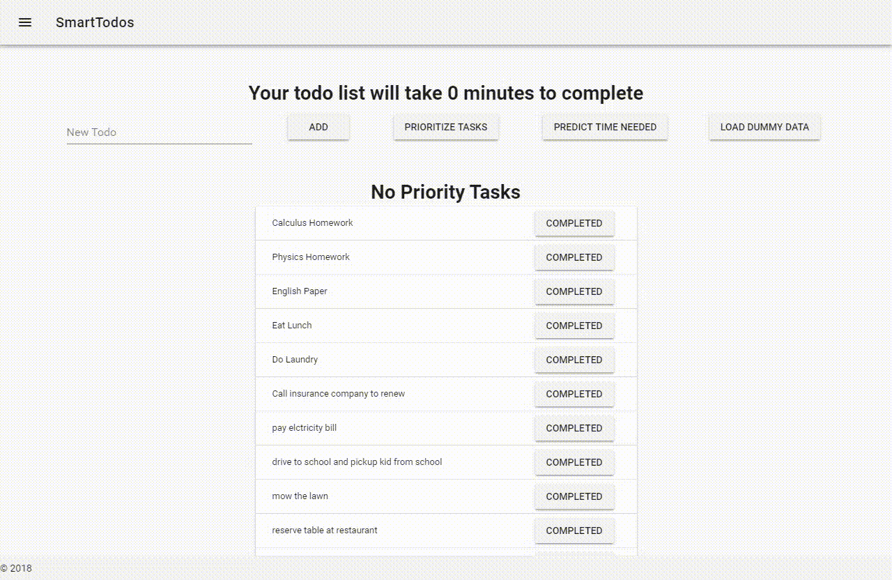

# SmartTodos - Organize your life with Machine Learning!

Ever had so many things to do that you didn't even know where to start? That's how I feel almost every day...

So I created this app to help alleviate this problem with Machine Learning. Drop in all the things you need to do into this app, and it will run a machine learning algorithm to determine which tasks are most important.

Don't know which task to do first in each category? Let Machine Learning tell you which fast will be the fastest to complete using the time prediction model. 

# How it's built.
The app was built in a 12 hour hackathon so it is very messy internally, but is uses Keras for the ML algo, Flask to run the API server for the machine learning, and VueJS + Vuetify + Axios for the frontend.
